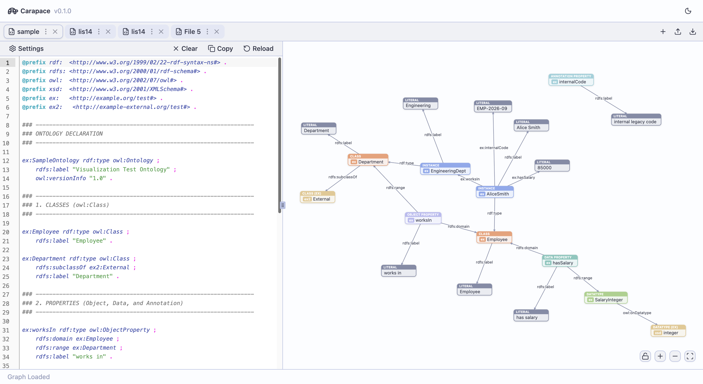
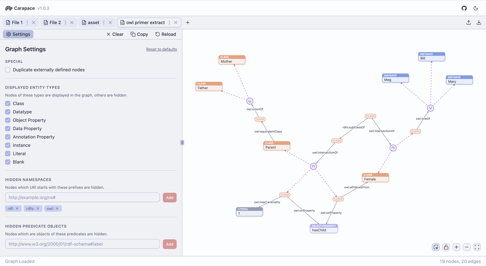

<h1 align="center">
   
  
   
  Carapace
   
</h1>

<h4 align="center">Turtle (TTL) ontology editor and graph visualiser.</h4>

**Carapace** is a text-first TTL graph visualiser. Easily import, export, navigate and edit TTL-based graphs through a native code editor, with live updates reflecting in the visualisation. Force graph computations are used to automatically spread out nodes, which can be manually arranged to your liking. The visualiser recognises [OWL (Web Ontology Language)](https://www.w3.org/OWL/) entity types, and also provides custom rendering for various concepts to improve readability.

  

    

## Features

- **Live Visualisation Updates:** Code editor updates the associated nodes in the graph as changes are made.
- **Syntax Highlighting:** Turtle file syntax highlighting supported by Codemirror.
- **Multiple Files:** Easily switch between multiple TTL files with independent graph settings.
- **Graph Controls:** Pan, zoom and scroll within the graph visualisation. Drag nodes to manually rearrange. Box select or ctrl/cmd + click to move multiple nodes at once. Lock node positions to maintain a manually arranged layout.
- **Fine-Grained Visualiser Settings:** Toggle visibility of nodes by entity types, and blacklist namespaces, predicates, or instances of types.
- **Search and Node-Line Mappings:** Searchbars in both the graph and editor. Buttons on the separator allow for line-to-node and node-to-line jumps based on selected cursor line or selected node.
- **Export as SVG:** Export to a high-quality visualisation that fits to the graph's bounding box.
- **Export/ Import State:** Export and import the state of TTL, graph and settings together to pick up exactly where you left off.
- **Light/ Dark Mode:** Good looking light and dark modes.

## Architecture

- **Framework:** Svelte 5 and SvelteKit
- **Graph:** D3.js Force Graph for layout calculations, with manual SVG-based rendering
- **Code Editor:** CodeMirror 6 with Turtle plugin and editor themes
- **Turtle:** N3.js Turtle parser
- **UI:** Shadcn-Svelte via Bits-UI, Svelte-Lucide for icons

## Motivation

There is a shortage of low-setup, modern tools for ontology work. Many general-purpose graph visualisers do not support ontology/ [OWL](https://www.w3.org/OWL/) specific rendering, and creating nodes and edges manually becomes tedious quickly. Carapace is text-based (TTL), free, open-source and deployed on the web at [carapace.space](http://www.carapace.space), allowing you to easily inspect and create modern-looking graphs compatible with other applications that work with TTL.
